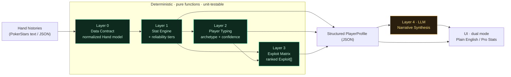
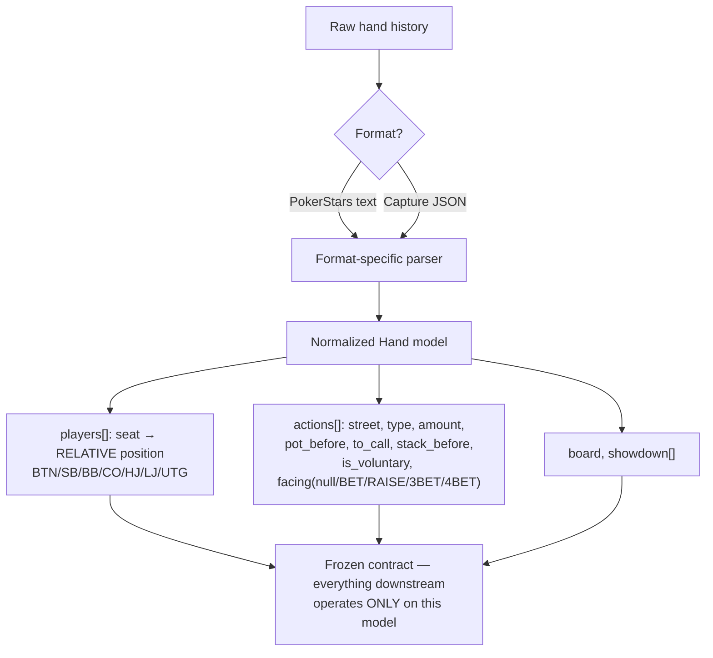
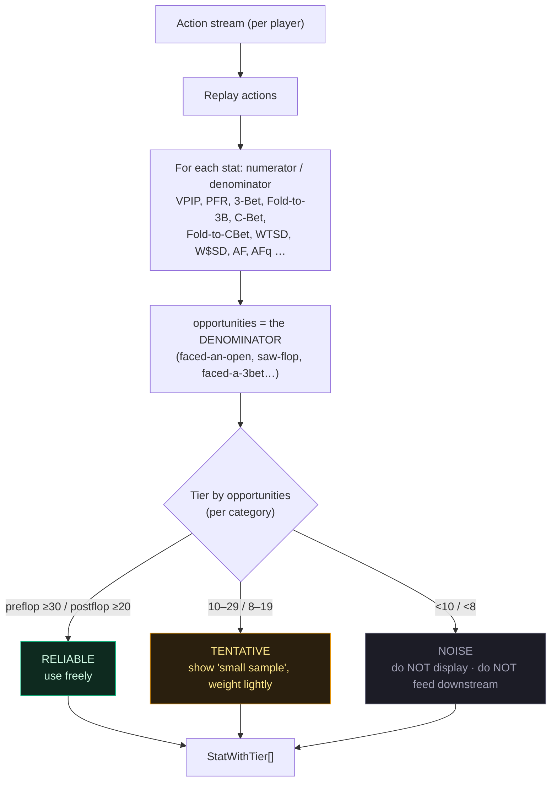
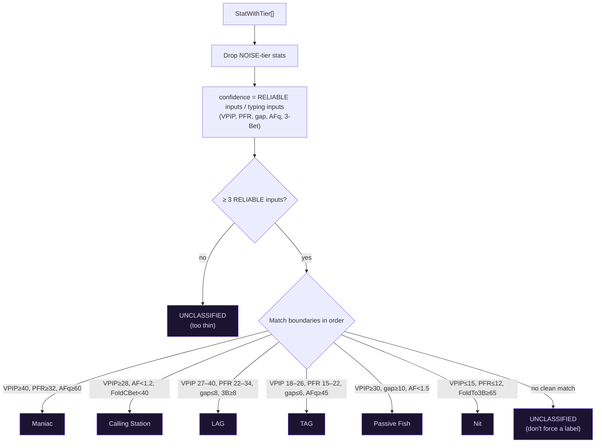
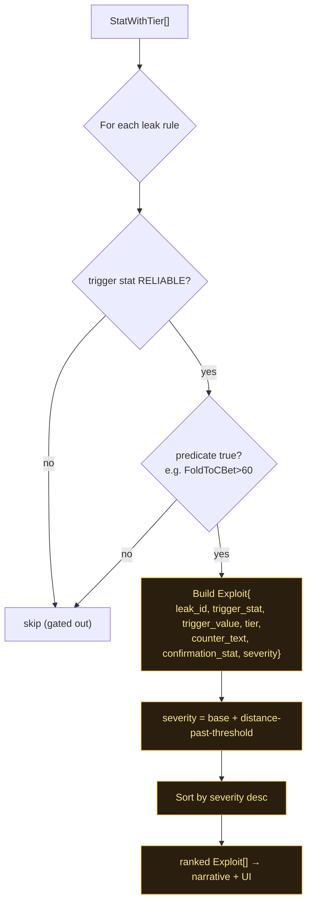
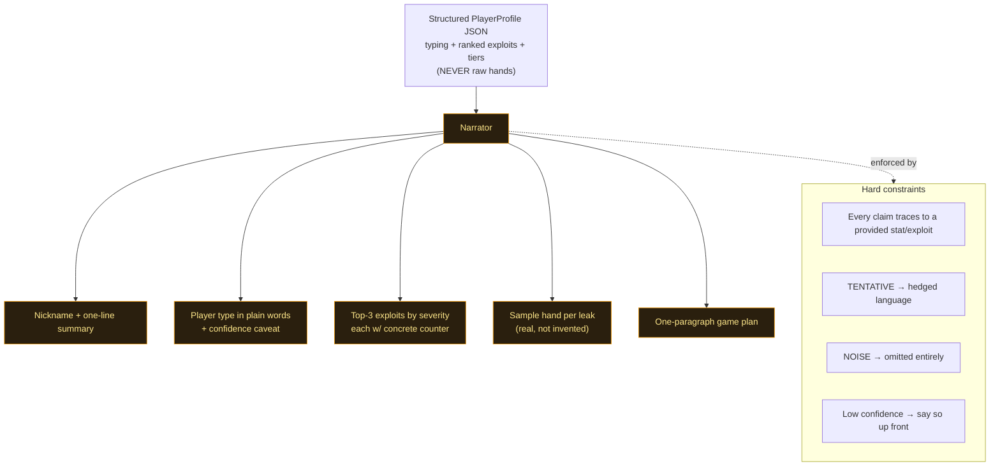
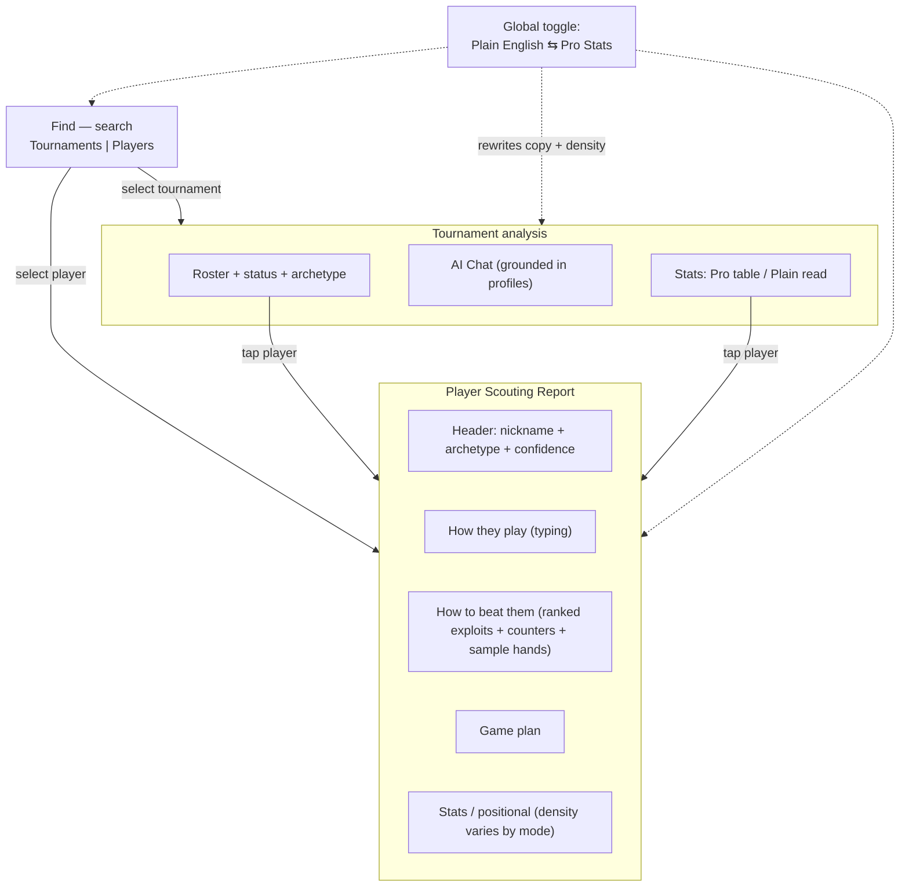

# Scout Engine — Flow Analysis (4-Layer Poker Player Analysis Engine)

> Companion document to the prototype in this folder. Source spec:
> `Poker_Analysis_Build_Spec.docx`. Everything below maps the spec's five
> layers (Data Contract → Stat Engine → Player Typing → Exploit Matrix →
> Narrative) to (a) deterministic flow charts and (b) the prototype files that
> implement each step.
>
> **Architectural law (spec §0):** *Computation is deterministic and testable;
> only the prose is generated.* Layers 1–3 are pure functions of hand data.
> Layer 4 (LLM in production) only narrates numbers already computed — it can
> never invent a read, a stat value, or a counter-strategy.

---

## 0. End-to-end pipeline

**Build & test order (spec §7):** freeze Layer 0 → build parser → stat engine +
tiers → typer & exploit matrix → narrator last (the only place the system can be
wrong in an unbounded way).

| Layer | Prototype file | Real production home (TournamentPro / hudr-pwa) |
|------|----------------|--------------------------------------------------|
| 0 Data Contract | `src/data/*` (mock) | `pokerStarsParser.ts` + `HandAction` (exists ✅) |
| 1 Stat Engine | `src/engine/statDefs.ts`, `tiers.ts`, `profile.ts` | `services/stats/*Detector.ts` (exists; tiers MISSING) |
| 2 Player Typing | `src/engine/typing.ts` | **MISSING** — to build |
| 3 Exploit Matrix | `src/engine/exploits.ts` | partial in `HudrTendencyNotes.tsx` |
| 4 Narrative | `src/engine/narrative.ts` (deterministic stand-in) | `supabase/functions/ai-analysis` |

---

## 1. Layer 0 — Data Contract

Why relative position matters (spec §1.3): a player who opens 18% overall might
open 45% on the button and 9% UTG — the average hides the read. Every action
stores relative position so positional stats are computable.

---

## 2. Layer 1 — Stat Engine + Reliability Gating

> **The single most dangerous failure mode** is a stat off too few hands that
> looks like a read. Tiers are per-denominator, tracked independently —
> Fold-to-3Bet may need hundreds of hands to reach RELIABLE.
>
> Prototype: `tiers.ts` (`computeTier`), thresholds in `TIER_THRESHOLDS`;
> per-stat denominators modelled in `statDefs.ts` (`oppMultiplier`).

---

## 3. Layer 2 — Player Typing

Boundaries are **explicit config** (`ARCHETYPE_BOUNDARIES` in `typing.ts`) so
they're tunable per tournament stage (stacks shrink, ranges widen). Output
carries a confidence score = fraction of typing inputs that are RELIABLE — a TAG
built on 3/5 reliable stats is weaker than one on 5/5, and that surfaces to the
narrative layer.

---

## 4. Layer 3 — Exploit Matrix

This is the product's value: a deterministic lookup mapping each leak to a
specific counter-move **and** a confirmation stat that tells you whether the
exploit is working. ~10 rules ship in `EXPLOIT_RULES` (`exploits.ts`):
fold-to-cbet>60, fold-to-turn-cbet>55, fold-bb-to-steal>70, fold-to-3bet>65,
cbet-flop>75, station, WTSD>32 w/ low W$SD, check-raise>12, donk>8, 3bet<4.
`severity` ranks which leaks lead the report.

---

## 5. Layer 4 — Narrative Synthesis (only LLM layer in production)

In this prototype the prose is generated **deterministically** from the profile
(`narrative.ts`) to demonstrate the constraint without an API call. In
production this becomes a Claude call whose input is the profile JSON only, with
a guardrail test that scans the output for any number not present in the input
(spec §6.3).

---

## 6. UX flow (dual-mode product)

**Dual-mode mapping** (one global toggle, `ModeContext`):

| Element | Plain English | Pro Stats |
|--------|---------------|-----------|
| Archetype | "Tight & Aggressive" | `TAG`, boundary trace |
| Stats | friendly name + meaning, bar; NOISE hidden | label + value + **tier chip** + opportunities; all shown |
| Reliability | "Strong / early / first-impression read" | RELIABLE / TENTATIVE / NOISE + opp counts |
| Exploit | "fire a bet on the flop and take the pot" | counter + trigger stat + severity + confirmation stat |
| AI answer | plain target advice | stat-cited, severity-aware |

---

## 7. What exists today vs. what this prototype adds

| Capability | Real hudr-pwa / TournamentPro | Prototype |
|-----------|-------------------------------|-----------|
| Parser + normalized model (L0) | ✅ exists | mock data |
| ~22 stats (L1) | ✅ exists, PT4-validated | modelled |
| Reliability tiers (L1) | ❌ ad-hoc only | ✅ first-class (RELIABLE/TENTATIVE/NOISE) |
| Positional open% (L1) | ⚠️ captured, not aggregated | ✅ per-seat with tiers |
| Player typing (L2) | ❌ missing | ✅ boundary-based + confidence |
| Exploit matrix (L3) | ⚠️ hardcoded strings | ✅ structured, RELIABLE-gated, ranked |
| Scouting report (L4) | ⚠️ no counters/game-plan/sample hands | ✅ full report, dual-mode |
| Dual Plain/Pro mode | ❌ | ✅ global toggle |

The roadmap to port these into production (RPCs for tiers + positional, pure
`playerTyping.ts` / `exploitMatrix.ts` mirrored into `_shared`, a `profile`
sub-route on `ai-analysis`, and the scouting UI upgrade) is in the planning doc
at `~/.claude/plans/analyze-this-document-and-mellow-thunder.md`.
